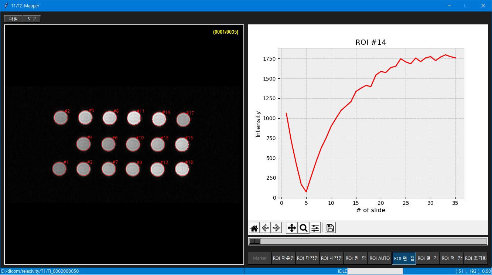
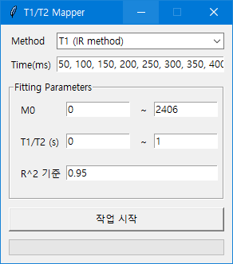
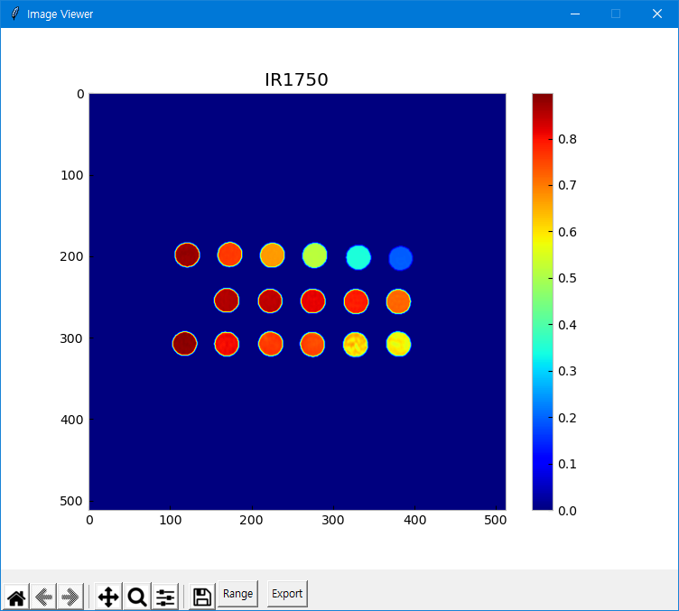

# T1_T2 Mapper

## Introduction
T1_T2 Mapper is the software for generating T1 and T2 maps.

## Features
 - Support manual ROI selection and auto ROI selection.
 - Mapping: T1w and T2w, T1w with IR(inversion recovery)

## Requirements
 - Python3
 - Numpy, Scipy
 - OpenCV, PIL, scikit-image
 - Pydicom, Nibabel
 - matplotlib

## Installation
    $ git clone https://github.com/kim01414/T1_T2_Mapper

## How to Use
When you downloaded files and installed all requiremnts, then running:
    
    $ python main.py

To generate map, following parameters must be needed.

## Screenshot

## Contacts
techman011@gmail.com

[BMRLab](http://bmr.knu.ac.kr/)
